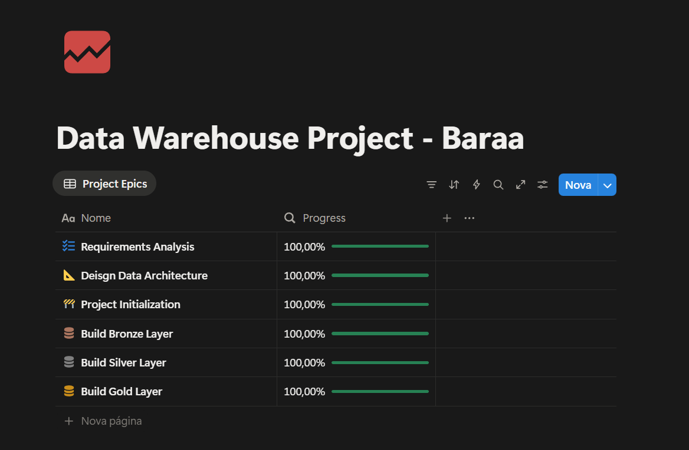

# Data Warehouse and Analytics Project
Bem-vindo ao Repositório! <br>
Esse projeto tem por objetivo ter a experiência de construir um Data Warehouse seguindo uma arquitetura de dados, incluindo todos os processos necessários para o total entendimento de como funciona Data Ingestion, Data Cleasing, Data Quality & Consistency. Usou-se ``Draw.io`` para os desenhos e ``Python``, ``SQL`` e conceitos de Banco de Dados para a efetiva criação do projeto.

**Créditos**: Curso "SQL Ultimate Course" do canal "Data With Baraa"


## Data Architecture 
A Arquitetura de Dados escolhida foi a Medallion, composta por três camadas:


1. ``Bronze Layer``: Armazena dados brutos como eles vieram do sistema de origem. Os dados são ingeridos de arquivos CSV dentro do MySQL.
2. ``Silver Layer``: Essa camada inclui processos de data cleasing (limpeza de dados), standardization (padronização) e normalização para preparar os dados para a análise.
3. ``Gold Layer``: Armazena dados prontos para uso comercial, modelados em um Star Schema necessários na geração de relatórios e análises.


<br>

## Project Overviews

**Esse Projeto Envolve:**
- Arquitetura de Dados: Projetando um Data Warehouse Moderno Usando a Arquitetura Medallion (Medalhão) com camadas Bronze, Silver e Gold.
- Pipelines ETL: Extraindo, transformando e carregando dados dos sistemas de origem para o data warehouse.
- Modelagem de Dados: Desenvolvendo tabelas de fatos e dimensões otimizadas para consultas analíticas.
- Análises & Relatórios: Criando relatórios e dashboards baseados em SQL para insights acionáveis.


### Especificações
- Fontes de Dados: Importar dados de dois sistemas de origem (ERP e CRM) fornecidos como arquivos CSV.
- Qualidade dos Dados: Limpar e resolver problemas de qualidade dos dados antes da análise.
- Integração: Combinar ambas as fontes em um único modelo de dados amigável, projetado para consultas analíticas.
- Escopo: Foco apenas no conjunto de dados mais recente; não é necessária a historização dos dados.
- Documentação: Fornecer documentação clara do modelo de dados para atender tanto às partes interessadas do negócio quanto às equipes de análise.

<br>

**Organização das Tarefas pelo Notion:**



<br>

## Repository Structure 
```
data-warehouse-project/
│   LICENSE
│   README.md
│
├───datasets
│   ├───source_crm
│   │       cust_info.csv
│   │       prd_info.csv
│   │       sales_details.csv
│   │
│   └───source_erp
│           CUST_AZ12.csv
│           LOC_A101.csv
│           PX_CAT_G1V2.csv
│
├───docs
│       data_architecture.png
│       data_catalog.md
│       data_flow.png
│       data_integration.png
│       data_layers.pdf
│       data_model.png
│       ETL.png
│       naming_conventions.md
│       project-schedule.png
│       Project_Notes_Sketches.pdf
│
├───scripts
│   │   init_database.sql
│   │
│   ├───bronze-layer
│   │       bronze_layers_tables_ddl.sql
│   │       bronze_layer_attempt_stored_procedure.sql
│   │       bronze_layer_tables_ddl.sql
│   │       etl_bronze.py
│   │
│   ├───gold-layer
│   │       create_dim_gold_layer.sql
│   │       create_fact_gold_layer.sql
│   │
│   └───silver-layer
│           load_crm_silver_layer.sql
│           load_erp_silver_layer.sql
│           silver_layer_tables_ddl.sql
│
└───tests
        quality_checks_gold.sql
        quality_checks_silver.sql
```

<br>

### About me
Sou Aaron Ferraz, Entusiasta de Dados a procura de se aprimorar cada vez mais.

[](https://www.linkedin.com/in/aaronferraz)
